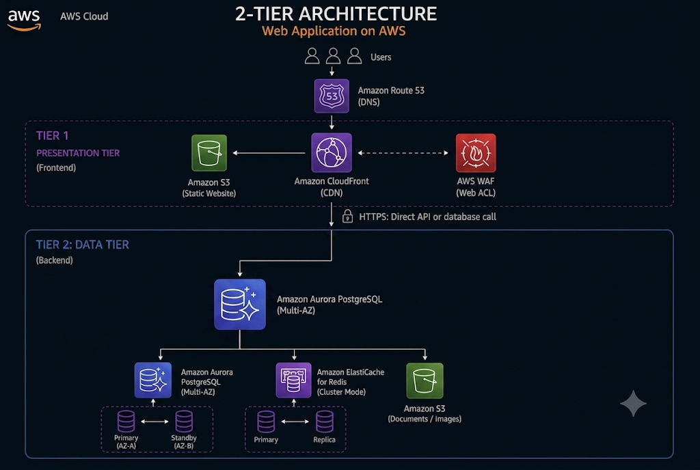
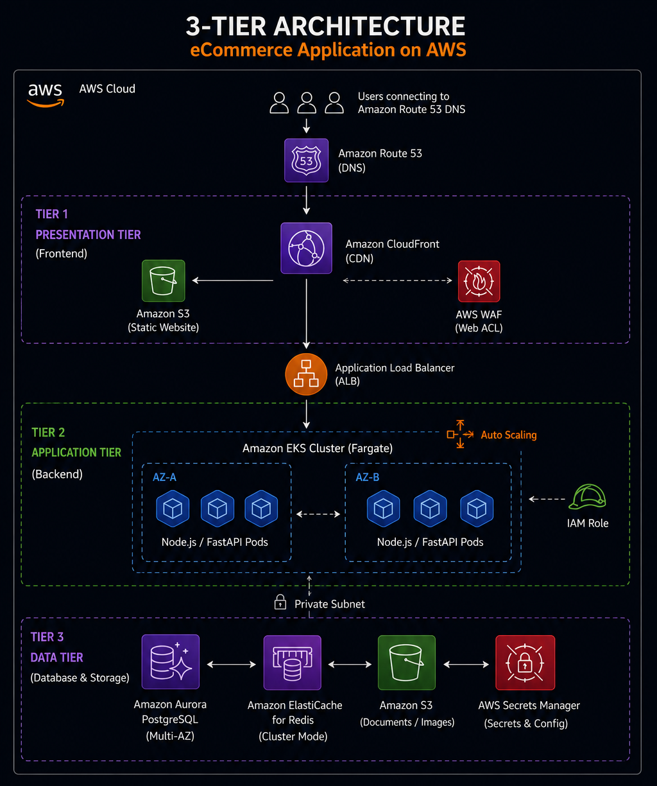

# AWS 3-Tier Architecture Overview

[Main Index](./aws-3-tier-architecutre.md) | [Next: Tier Services ->](./02-tier-services.md)

---

A **"tier"** is a functional layer, not a service count. The 3-tier split is:

- **Presentation tier** — what the user's browser talks to (frontend, CDN, DNS)
- **Application tier** — where business logic runs (compute, API layer)
- **Data tier** — where state is stored (databases, cache, object storage)

---

## 2-Tier vs 3-Tier — The Actual Difference

### Architecture Visual Comparison

| 2-Tier Architecture | 3-Tier Architecture |
| :---: | :---: |
|  |  |

---

### 2-Tier
- **Client -> Database directly**
- App logic and data logic sit together (same server or tightly linked)
- Easy to build, hard to scale
- One weak layer = whole system exposed (client can touch data layer)

### 3-Tier
- **Client -> App layer -> Data layer**
- Each layer does **ONE** job only:
  - **Presentation** = what user sees
  - **Application** = business rules, processing
  - **Data** = storage only

---

### Why 3-Tier Wins (Memorize these 3 points):
1. **Scale separately** — traffic spike? Add more app servers. DB stays untouched.
2. **Fail separately** — app crashes, DB is still safe. No single point drags everything down.
3. **Secure separately** — client never touches the database directly. App layer acts as a gatekeeper/filter in between.

> **One-line memory hook:**
> - **2-tier** = client shakes hands with the database.
> - **3-tier** = client shakes hands with the app, app shakes hands with the database.

---

## Deep Dive Questions

### Q1: Why is the data tier unreachable by the client directly?
- **App tier acts as a gatekeeper**
- It checks: *is this user allowed? is this input safe? does this break any business rule?*
- Only after passing those checks does a request reach the database
- Data tier sits in a private subnet — client has no network path to it even if it tried
- Removes the client's ability to send raw, unchecked commands straight to your data

### Q2: What does coupling cause in a 2-tier system?
- App and database are tightly linked — not independent units
- **Cost problem:** to scale app servers for more traffic, you often have to scale the DB too, even if DB wasn't the bottleneck
- **Security problem:** no buffer layer between client and data — a bug or attack on the client-facing side has a direct line to the database
- **Failure problem:** one component crashing can drag the other down with it — no isolation

---

[Main Index](./aws-3-tier-architecutre.md) | [Next: Tier Services ->](./02-tier-services.md)
