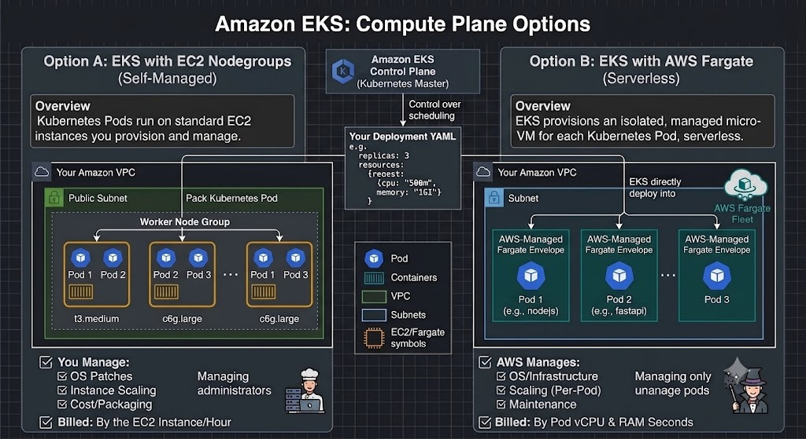
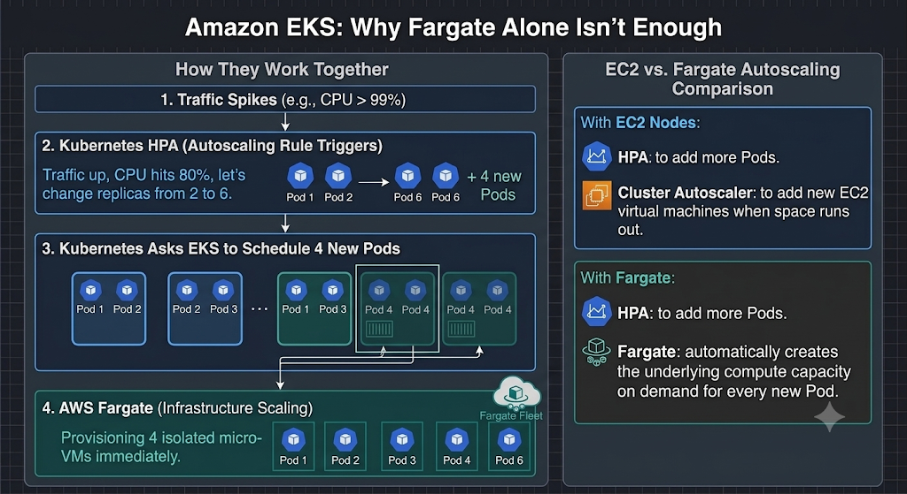
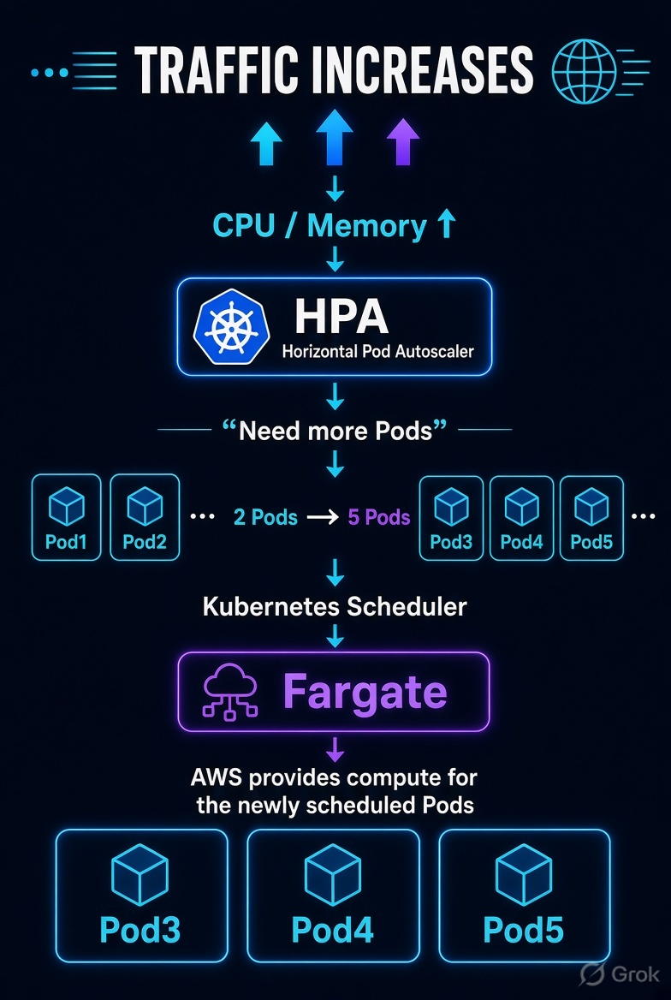

# Compute Options: EKS + EC2 vs EKS + Fargate

[<- Previous: Tier Services](./02-tier-services.md) | [Main Index](./aws-3-tier-architecutre.md) | [Next: Well-Architected Pillars ->](./04-well-architected-pillars.md)

---

## EKS Compute Strategy

### 1. If you choose EKS + EC2
- You create and own the EC2 instances (they show up in your EC2 dashboard).
- EKS takes your Kubernetes Pods and schedules them onto those EC2 instances.
- Multiple pods share one EC2 instance to save money and maximize resources.
- **Your job:** You pick the server size (CPU/RAM), handle OS updates, and manage node scaling.

### 2. If you choose EKS + Fargate
- You do not create EC2 instances.
- When you tell Kubernetes to run a Pod, AWS behind the scenes spins up a dedicated, isolated micro-virtual machine (VM) just for that one Pod.
- AWS manages that hidden compute server completely — patching the OS, securing it, and deleting it the exact second your Pod stops.
- **Your job:** You just write the Kubernetes deployment file (specifying `cpu: "500m"`, `memory: "1Gi"`), and AWS bills you only for that pod's runtime.

---

## Important Note: Fargate is On-Demand Infrastructure
- **Fargate is purely on-demand infrastructure:**
  - If your Kubernetes deployment YAML says `replicas: 2`, Fargate will run exactly 2 pods forever.
  - If traffic explodes and CPU hits 99%, Fargate will **not** increase that number to 5 pods on its own. It only executes what Kubernetes tells it to.

---

## How Fargate Scaling Actually Works (Step-by-Step)

> **Step-by-Step Scaling Lifecycle:**
> 1. **HPA detects high utilization:** Horizontal Pod Autoscaler monitors workload metrics (e.g., CPU hitting 99%).
> 2. **HPA increases desired replicas:** Target replica count updates (e.g., from `2` -> `5`).
> 3. **Kubernetes requests additional Pods:** Kubernetes needs 3 additional Pods scheduled.
> 4. **Fargate provisions compute capacity:** Fargate automatically provisions the required compute capacity for those Pods.
> 5. **New Pods start running:** The new Pods execute and start processing incoming requests.
> 6. **Scale-down on reduced demand:** When traffic drops, HPA reduces replicas back down.
> 7. **Compute released:** Those Pods terminate, and their associated Fargate compute resources are released.

  

---

## Important Concept & Abstraction Note

> **Infrastructure Abstraction:**
> Don't think of it strictly as: *"Fargate creates one VM, then puts one Pod inside it."*
> - Fargate's implementation is abstracted away from you. AWS manages the underlying infrastructure and gives each Fargate Pod its isolated compute environment.

> **Golden Rule to Memorize:**
> **HPA scales Pods. Fargate supplies the infrastructure needed to run those Pods.**

---

[<- Previous: Tier Services](./02-tier-services.md) | [Main Index](./aws-3-tier-architecutre.md) | [Next: Well-Architected Pillars ->](./04-well-architected-pillars.md)
